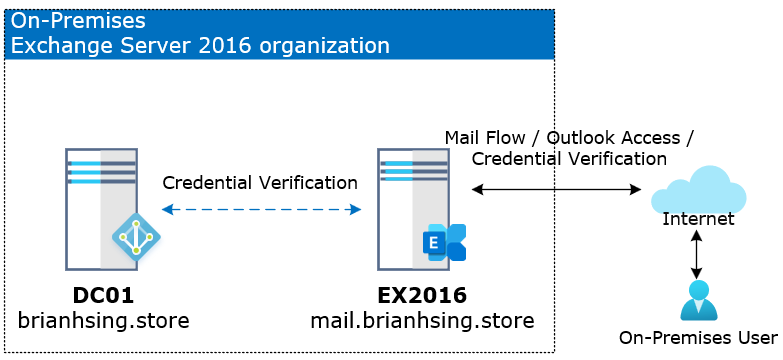

# Exchange-Hybrid-Deployments

## Exchange Server 混合式佈署模擬環境說明
- On-Premises 模擬環境架構圖 
   
- Exchange Server 2016 以上混合式佈署環境架構圖 (本篇採用此架構) 
- Exchange Server 2007 / 2010 / 2013 混合式佈署環境架構圖 
## 前置作業
- 客戶必須要先開通 Microsoft 365 Tenant 並且擁有全域管理員帳號 
- 內部環境架構確認 
  - 確認現有的網域控制站的樹系等級在 Windows Server 2003 以上。 
  - 確認現有的網域控制站的作業系統版本。 
  - 確認現有的Exchange Server 伺服器為 Exchange 2010 SP3、Exchange 2010 SP3、Exchange 2016 和 2019 Exchange 或更新版本。 
  - 確認現有郵件服務的對內與對外的 FQDN。 
  - 確認現有郵件服務的憑證類型，確認客戶是使用自我簽署憑證，還是第三方購買之 SAN SSL、Wildcard 等類型的憑證。 
  - 確認現有的郵件服務環境是否有 Anti-Spam、Anti-Virus 或郵件封存等第三方服務。 
  - 確認未來混合式佈署架構的郵件路由，例如，MX 紀錄指向雲端還是地端、統一由雲端對外發信或各自均可直接對外發信。 
  - 確認要同步的組織單位。 
  - 確認每個信箱大小、資料庫數量、資料庫大小。 
  - 確認對外 ISP 上傳頻寬。 
- 客戶環境準備 
  - 虛擬機器 for Azure AD Connect tool 
    - 虛擬機器規格 2 vcpu、4 GB RAM、127 GB Disk。 
    - 作業系統需要安裝 Windows Server 2016 以上版本。 
  - 虛擬機器 for Exchange Server (option) 
    - 如果客戶環境是 Exchange Server 2007 / 2010 / 2013 的版本，強烈建議多建立一台 Exchange Server 用於混合式佈署。 
    - 虛擬機器規格 2 vcpu、8 GB RAM、127 GB Disk。 
    - 虛擬機器網路建議不通過防火牆，直接與 Microsoft 365 進行連線，主要用到的 Port 為 25、80、443。 
  - 受信任的第三方憑證認證機構所頒發的憑證，SAN SSL 或 Wildcard SSL。 
## 佈署流程

