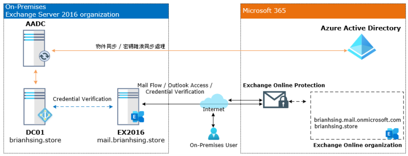
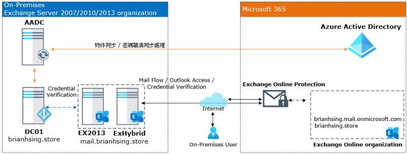

# Exchange-Hybrid-Deployments

## Exchange Server 混合式佈署模擬環境說明
- On-Premises 模擬環境架構圖 
   
  - DC01：Windows Server 2016
  - AD 樹系等級：Windows Server 2016
  - EX2016：Windows Server 2016
  - Exchange 版本：Exchange Server 2016 CU23
- Exchange Server 2016 以上混合式佈署環境架構圖 (本篇採用此架構) 
  Exchange Server 2016 建議在同一台上直接啟用 Exchange Hybrid 功能，可以直接透過既有的 Exchange External 與 Exchange Online 做混合佈署。此範例所使用的 M365 Tenant 的自訂網域為 brianhsing.store。 
   
- Exchange Server 2007 / 2010 / 2013 混合式佈署環境架構圖 
  Exchange Server 2016 以下的版本，建議在同個 Exchange 組織內建立一台 Exchange Server 專門用於與 Exchange Online 做混合佈署得設置。此作法可以免去傳統 Exchange Server 需要對應支援版本的麻煩，而此台 Exchange Server 授權，會在進行 Exchange Hybrid 佈署時授予。此信箱僅限用於 Exchange Server 與 Exchange Online 郵件路由傳輸之用途，不能將資料庫與信箱建立在此 Exchange Server 上。 
   
## 前置作業
- 客戶必須要先開通 Microsoft 365 Tenant 並且擁有全域管理員帳號 
- 內部環境架構確認 
  - 確認現有的網域控制站的樹系等級在 Windows Server 2003 以上。 
  - 確認現有的網域控制站的作業系統版本。 
  - 確認現有的Exchange Server 伺服器為 Exchange 2010 SP3、Exchange 2010 SP3、Exchange 2016 和 2019 Exchange 或更新版本。 
  - 確認現有郵件服務的對內與對外的 FQDN。 
  - 確認現有郵件服務的憑證類型，確認客戶是使用自我簽署憑證，還是第三方購買之 SAN SSL、Wildcard 等類型的憑證。 
  - 確認現有的郵件服務環境是否有 Anti-Spam、Anti-Virus 或郵件封存等第三方服務。 
  - 確認未來混合式佈署架構的郵件路由，例如，MX 紀錄指向雲端還是地端、統一由雲端對外發信或各自均可直接對外發信。 
  - 確認要同步的組織單位。 
  - 確認每個信箱大小、資料庫數量、資料庫大小。 
  - 確認對外 ISP 上傳頻寬。 
  - 確認客戶用戶端的 Outlook 版本。 

  Microsoft 365 

  |項目|實際環境|
  |:----:|:--------:|
  |Global Admin|admin@brianhsing.store|
  |Custom Domain|brianhsing.store|
  |Client App Outlook Version|Office 365 app for enterprise|

  On-Premises 

  |項目|實際環境|
  |:--------:|:--------:|
  |Active Directory forest root|admin@brianhsing.store|
  |Domain Controller Name|brianhsing.store|
  |Domain Controller OS|Windows Server 2016|
  |Domain Forest Functional Levels|Windows Server 2016|
  |Exchange Server Name|EX2016|
  |Exchange Server OS|Exchange Server 2016|
  |Exchange Server CU|Exchange Server 2016 CU23|
  |Internal Exchange Server FQDN|EX2016.brianhsing.store|
  |External Exchange Server FQDN|mail.brianhsing.store|
  |Internal Autodiscover FQDN|autodiscover.brianhsing.store|
  |External Autodiscover FQDN|autodiscover.brianhsing.store|
  |Certificate Typer|SAN SSL|
  |Database Size| 250 MB |
  |Mailbox Size limit | 2 GB|
  |ISP Internet Speed|500 Mbps / 250 Mbps|
  |Sync OU Select|M365|

- 客戶環境準備 
  - 虛擬機器 for Azure AD Connect tool 
    - 虛擬機器規格 2 vcpu、4 GB RAM、127 GB Disk。 
    - 作業系統需要安裝 Windows Server 2016 以上版本。 
  - 虛擬機器 for Exchange Server (option) 
    - 如果客戶環境是 Exchange Server 2007 / 2010 / 2013 的版本，強烈建議多建立一台 Exchange Server 用於混合式佈署。 
    - 虛擬機器規格 2 vcpu、8 GB RAM、127 GB Disk。 
    - 虛擬機器網路建議不通過防火牆，直接與 Exchange Online 進行連線，主要用到的 Port 為 25、80、443。 
  - 受信任的第三方憑證認證機構所頒發的憑證，SAN SSL 或 Wildcard SSL。 

## 佈署流程

- 目錄同步處理
- Exchange Server 混合式佈署